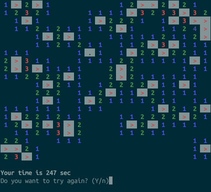

minesweeper-cli-rs
==================

My first Rust program.



### Controls:
- Cursor move: **WASD**
- Fast cursor move: **Shift + WASD**
- Open cell: **Space**
- Place flag: **F or Tab**
- Auto open: **E**
- Exit: **Esc**

### Downloading and running:
```bash
$ git clone https://github.com/mirai65536/minesweeper-cli-rs.git
$ cd minesweeper-cli-rs
$ cargo run
```

